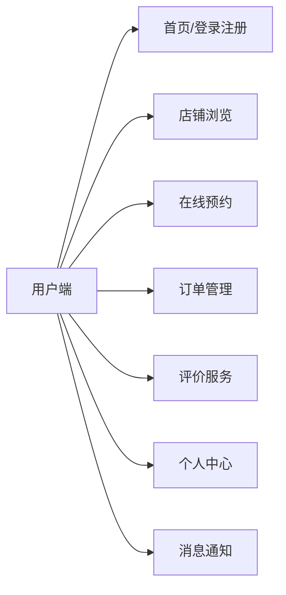
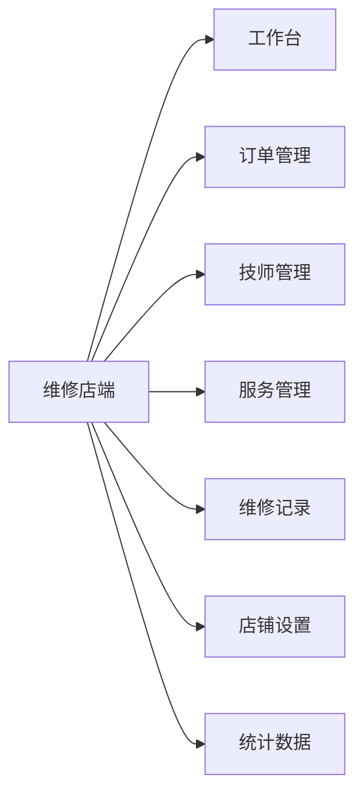
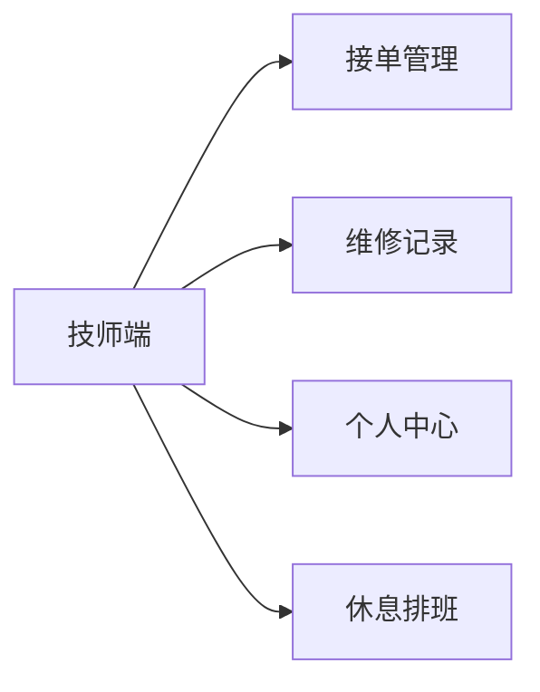
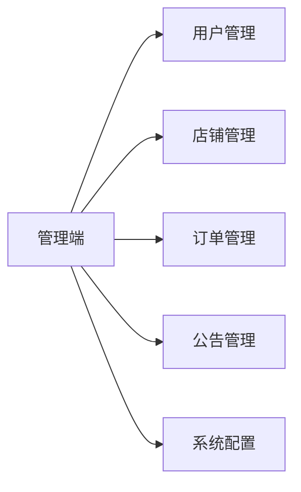
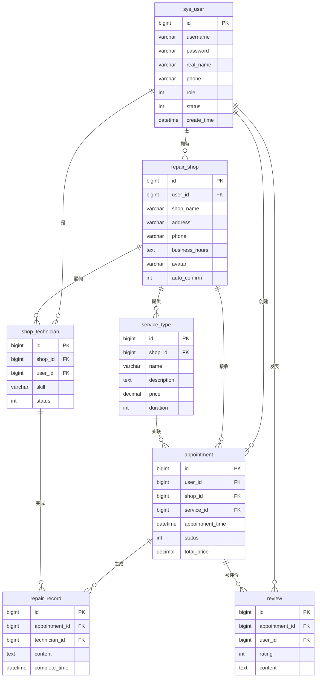

# 摩托车维修管理系统架构图

## 一、系统整体架构

```mermaid
graph TB
    subgraph "用户层"
        A[用户端]
        B[维修店端]
        C[技师端]
        D[管理端]
    end

    subgraph "前端层 (Vue3 + Element Plus)"
        subgraph "路由层"
            E[Vue Router]
        end
        subgraph "视图层"
            F[用户模块<br/>(预约、评价、店铺)]
            G[维修店模块<br/>(订单、技师、店铺)]
            H[技师模块<br/>(接单、记录)]
            I[管理模块<br/>(用户、店铺、订单)]
        end
        subgraph "状态管理层"
            J[Pinia Store<br/>(用户、配置)]
        end
        subgraph "API层"
            K[Axios请求封装]
        end
    end

    subgraph "后端层 (Spring Boot 3.x)"
        subgraph "控制器层"
            L[AuthController<br/>认证]
            M[AppointmentController<br/>预约]
            N[RepairShopController<br/>店铺]
            O[ServiceTypeController<br/>服务]
            P[UserController<br/>用户]
            Q[AdminController<br/>管理]
        end
        subgraph "服务层"
            R[UserService]
            S[AppointmentService]
            T[RepairShopService]
            U[OssService<br/>阿里云OSS]
            V[StatisticsService]
        end
        subgraph "数据访问层"
            W[UserMapper]
            X[AppointmentMapper]
            Y[RepairShopMapper]
            Z[其他Mapper...]
        end
        subgraph "配置与安全"
            AA[SecurityConfig<br/>安全配置]
            AB[JwtAuthenticationFilter<br/>JWT认证]
            AC[OssConfig<br/>阿里云OSS]
            AD[MybatisPlusConfig<br/>MyBatis-Plus]
        end
    end

    subgraph "数据层"
        subgraph "MySQL数据库"
            AE[sys_user<br/>用户表]
            AF[repair_shop<br/>店铺表]
            AG[appointment<br/>预约订单表]
            AH[service_type<br/>服务类型表]
            AI[shop_technician<br/>店铺技师表]
            AJ[repair_record<br/>维修记录表]
            AK[review<br/>评价表]
            AL[system_config<br/>系统配置表]
            AM[其他表...]
        end
        subgraph "文件存储"
            AN[阿里云OSS<br/>图片存储]
        end
    end

    A -->|HTTP| K
    B -->|HTTP| K
    C -->|HTTP| K
    D -->|HTTP| K

    K -->|RESTful API| L
    K -->|RESTful API| M
    K -->|RESTful API| N
    K -->|RESTful API| O
    K -->|RESTful API| P
    K -->|RESTful API| Q

    L --> R
    M --> S
    N --> T
    O --> T
    P --> R
    Q --> V

    R --> W
    S --> X
    T --> Y
    V --> W
    V --> X
    V --> Y

    W --> AE
    X --> AG
    Y --> AF
    AE --> AF
    AF --> AI
    AG --> AH
    AG --> AJ
    AG --> AK

    U --> AN
```

## 二、功能模块划分

### 2.1 用户端功能模块


### 2.2 维修店端功能模块


### 2.3 技师端功能模块


### 2.4 管理端功能模块


## 三、数据库表关系



## 四、技术栈说明

| 层级 | 技术选型 |
|------|----------|
| **前端框架** | Vue 3 + Vite |
| **UI组件库** | Element Plus |
| **状态管理** | Pinia |
| **路由** | Vue Router |
| **HTTP客户端** | Axios |
| **后端框架** | Spring Boot 3.x |
| **ORM框架** | MyBatis-Plus |
| **数据库** | MySQL 8.0 |
| **缓存** | （待扩展）Redis |
| **文件存储** | 阿里云OSS |
| **认证授权** | JWT |
| **版本控制** | Git |
